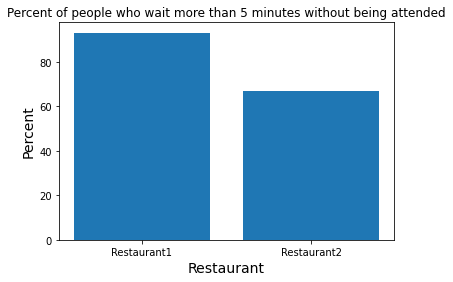

# Kojo's Kitchen
#### José Alejandro Labourdette - Lartigue Soto C-412

### Sobre las variables aleatorias
En el problema se trabaja con la generación de 2 tipos de variables aleatorias:
- Uniformes(a, b)
- Exponencial(lda)

Para la generación de la variable aleatoria Uniforme x en el intervalo [a, b] se generó un número
y entre 0 y 1 con distribución uniforme y se utilizó la función.
```
x = a + (b-a) * y
```
Para generar una variable aleatoria uniforme discreta en el intervalo [a, b] se divide el segmento
[0,1] en b-a+1 partes iguales. El número del intervalo en el que está la variable generada con 
U(0,1) es el devuelto.

Para generar la variable exponencial se usa la función:
```
-(1 / lda) * math.log(x, math.e)
```
Donde lda es un parámetro y x es una variable aleatoria con función de distribución uniforme en el
intervalo [0, 1]. Para obtener el valor discreto se toma la parte entera del valor devuelto por
dicha función

### Sobre el problema
El problema plantea la comparación de dos posibles configuraciones en la cocina. La primera es 
usando 2 cocineros a lo largo de toda la jornada y la segunda usando un tercero en los horarios
picos de almuerzo y comida.

Para la comparación veremos como se comportan los 2 casos. Por ellos se tendrán 2 restaurant con 
estos tipos de cocinas(restaurant1 tendrá cocina1 y restaurant2 tendrá cocina2). A estos 
restaurant se les informará sobre la llegada de clientes y él lo informará a su cocina, de 
modo que cada uno de los restaurantes trabajará de manera independiente.

En ambos restaurantes se recibirán clientes hasta la hora de cierre(9:00 pm). Esto puede 
traducirse en que la hora de salida del último cliente no tiene que ser antes del cierre.


### Sobre el tiempo
La cocina de Kojo es un problema en el tiempo y por tanto hay que simular su transcurso para 
que ocurran los sucesos. El primer problema a resolver antes de adentrarse en la simulación es 
precisamente este.

El tiempo es lineal, y para cualquiera dos instantes podemos saber cuál va primero y cuál 
después tal y como sabemos dado dos números reales cuál es el menor. Si se lograra saber, de 
todos los eventos distintos posibles a ocurrir, el instante en el que se producirán entonces 
podemos adelantarnos directamente a ese instante sin correr el riesgo de saltar la ejecución 
de algún evento posible en nuestra simulación.

En el problema actual se da en un intervalo del dia: de 10:00 am hasta 9:00 pm Si asumimos como 
unidad atómica el minuto entices la jornada quedara dividida en 660 partes iguales. Si se dice 
que un suceso A ocurre en el minuto 84 y B en el 67, es inferible que el suceso B ocurre antes 
que A.

Queda entonces el problema de ¿cómo saber cuando ocurrirá un evento?.

###  Sobre los eventos
Para simular el problema se definen 3 eventos posibles a ocurrir:
- Llegada de un nuevo cliente
- Salida de un cliente en el restaurant 1
- Salida de un cliente en el restaurant 2


#### Llegada de un nuevo cliente
El tiempo de llegada de un nuevo cliente puede simularse usando una variable aleatoria con función
de distribución exponencial. Sea un instante de tiempo **t**(en el que llega una persona), y
**x** VA con función de distribución exponencial(discreta) la llegada del próximo cliente pude 
esperarse para el instante **t+x +1** (dado que x nos da valores que incluyen al 0).

#### Salida de un cliente
En cada restaurant puede haber multiples clientes, pero este evento referencia al que primero 
saldrá de todos ellos. En caso de haber varios se selecciona cualquiera. Una vez la orden de un 
cliente pasa a la cocina el tiempo de salida de ese cliente del restaurant se puede conocer 
mediante la suma del tiempo actual de la jornada y el tiempo que toma realizar la orden.

De esta manera se conocen los tiempos en que ocurrirá el proxime evento de cada tipo.

### Sobre las horas críticas del día
La llegada de los clientes están espaciadas en intervalos que siguen una distribución exponencial.
Las variables aleatorias de este tipo necesitan un parámetro landa para su generación. Mientras
mayor sea ese parámetro más probabilidad tendrá la variable de generar un valor cercano a 0. 
Para simular el horario crítico se incrementa el valor landa de la generación de variables en los 
intervalos de minutos [90; 210] y [420; 540].

### Sobre el pedido de los clientes
Se define con un 50% la probabilidad de pedir sandwich o sushi. De igual manera se usa una 
variable aleatoria con función de distribución uniforme para definir el tiempo que demorará la
elaboración del pedido. Sin alterar los resultados del problema se definen estas variables en 
el momento en que se crean los clientes.

### Sobre los valores de landa
La selección de ambos valores landa es una tema debatible. El problema está en que valores muy
pequeños causarían carencia de clientes, mientras que valores grandes sobrecargan el restaurant.
Veamos ejemplos con distintos valores de landa (tanto el valor normal como el crítico) en una
gráfica que muestra la cantidad de clientes en el restaurant cuya orden no ha sido tomada en cada
minuto.

||
|:---:|
|lda=0.3 lda_critic = 0.6| 

||
|:---:|
|lda=0.4 lda_critic = 0.6| 

||
|:---:|
|lda=0.5 lda_critic = 0.9| 

A medida que los valores de landa aumentan más clientes se encuentran en la cola de espera 
simultáneamente. Esto influye directamente en el porciento de personas atendidas luego de 5 o más
minutos de estar en la cola.

### Comparación de resultados
Luego de realizar 10000 simulaciones, el promedio de personas que permanecen sin ser atendidas por 
5 o más minutos en ambos casos es el siguiente:




## Concluyendo
Asumiendo el caso de lda = 0.2 y lda_critic = 0.4 que genera un aproximado de 50% de personas
esperando 5 o más minutos vemos que se reduce esta cantidad a un 20%. Se redujo más de un 50% la
insatisfacción en las personas.

Queda también en el repositorio un jupyter notebook que da más información sobre las simulaciones
incluyendo gráficos no mostrados acá que ayudan a entender mejor los datos.